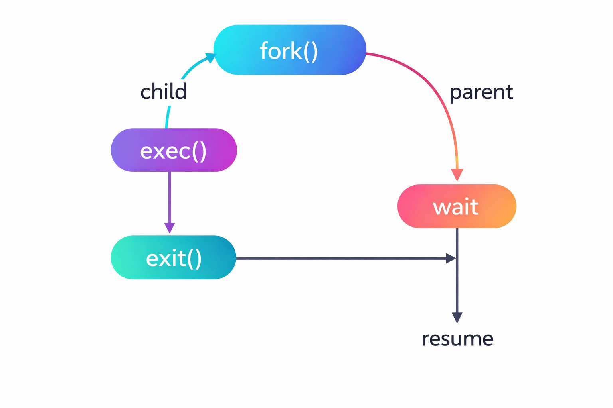

# Process Operations

#### Core Operations an OS Performs on Processes Throughout Their Lifecycle

> The OS provides a defined set of operations to create, manage, and terminate processes. These operations form the backbone of process management in any operating system.

---

## 📌 Table of Contents

| # | Topic |
|---|-------|
| 1 | [Overview](#1-overview) |
| 2 | [✦ Process Creation](#2--process-creation) |
| 3 | [✦ Process Termination](#3--process-termination) |
| 4 | [✦ Process Waiting](#4--process-waiting) |
| 5 | [✦ Process Scheduling](#5--process-scheduling) |
| 6 | [✦ Inter-Process Communication](#6--inter-process-communication) |
| 7 | [Parent and Child Processes](#7-parent-and-child-processes) |
| 8 | [Orphan and Zombie Processes](#8-orphan-and-zombie-processes) |
| 9 | [Interview Questions](#9-interview-questions) |
| 10 | [Resources](#10-resources) |

---

## 1. Overview

> The OS performs five fundamental operations on every process from birth to termination.

- **Creation** -> a new process is spawned by the OS or a parent process
- **Scheduling** -> OS decides when and on which CPU core the process runs
- **Execution** -> process actively runs instructions on the CPU
- **Waiting** -> process pauses for I/O or a resource
- **Termination** -> process finishes and all its resources are reclaimed

```
Create -> Ready -> Running -> Waiting -> Ready -> Running -> Terminate
```

---

## 2. ✦ Process Creation

> A new process is created by an existing process using a system call.

- In Unix/Linux the system call used is `fork()`
- In Windows the system call used is `CreateProcess()`
- The process that creates another is called the **parent process**
- The newly created process is called the **child process**
- Every process except the first one is created by another process -> forming a process tree
- The first process on a Linux system is `systemd` or `init` with PID 1

**Steps in process creation:**
- OS assigns a unique Process ID to the new process
- OS allocates memory for text, data, heap, and stack segments
- OS initializes a PCB for the new process
- OS loads the program into the allocated memory
- OS places the process in the Ready queue

**Resource sharing options between parent and child:**

| Mode | Description |
|------|-------------|
| Full sharing | Child gets a copy of all parent resources |
| Partial sharing | Child shares only a subset of parent resources |
| No sharing | Child gets entirely new independent resources |

**Execution options after `fork()`:**
- Parent and child execute concurrently
- Parent waits using `wait()` until child finishes before continuing

**Address space options:**
- Child is an exact duplicate of parent -> `fork()` in Unix
- Child loads a new program into its address space -> `exec()` after `fork()` in Unix


> *fork() splits into child and parent paths. Child calls exec() then exit(). Parent calls wait() and resumes after child exits.*

```
Parent Process
     │
     │ fork()
     ▼
Child Process (copy of parent)
     │
     │ exec()
     ▼
Child runs a new program
```

---

## 3. ✦ Process Termination

> A process terminates when it finishes execution or is forcefully killed.

- Normal termination -> process calls `exit()` system call after completing its task
- Error termination -> process calls `exit()` after detecting an unrecoverable error
- Fatal termination -> OS kills the process due to illegal instruction, segmentation fault, or resource limit violation
- Forced termination -> parent kills child using `kill()` system call in Unix or `TerminateProcess()` in Windows

**Steps in process termination:**
- Process executes `exit()` or is killed
- OS reclaims all memory allocated to the process
- OS closes all open file descriptors listed in the PCB
- OS releases all I/O devices and locks held by the process
- Exit status is stored temporarily in PCB until parent reads it via `wait()`
- PCB is deleted after parent reads exit status

**Reasons a parent may terminate a child:**
- Child has exceeded its allocated resource limits
- Task assigned to child is no longer needed
- Parent itself is terminating -> in some OS, children cannot outlive parents

---

## 4. ✦ Process Waiting

> A parent process can wait for its child to finish before proceeding.

- Done using the `wait()` system call in Unix/Linux
- `wait()` blocks the parent until one of its children terminates
- `waitpid()` waits for a specific child process by PID
- After child terminates, parent retrieves the child's exit status
- This prevents zombie processes from accumulating in the system

```
Parent calls wait()
     │
     │ Blocked until child finishes
     ▼
Child calls exit()
     │
     ▼
OS sends signal to parent
     │
     ▼
Parent resumes with child's exit status
```

---

## 5. ✦ Process Scheduling

> The OS scheduler decides which process from the Ready queue gets CPU time next.

- **Long-term scheduler** -> controls which jobs enter the ready queue from the job pool, runs infrequently
- **Short-term scheduler** -> selects which ready process runs on CPU next, runs very frequently
- **Medium-term scheduler** -> handles swapping of processes between RAM and disk

**Scheduling queues:**

```
Job Pool
   │
   │ Long-term scheduler admits
   ▼
Ready Queue -> Short-term scheduler dispatches -> CPU
                                                    │
                                              I/O Request
                                                    │
                                                    ▼
                                              I/O Wait Queue
                                                    │
                                              I/O Complete
                                                    │
                                                    ▼
                                              Back to Ready Queue
```

---

## 6. ✦ Inter-Process Communication

> Processes often need to communicate and share data -> IPC mechanisms enable this safely.

- Independent processes do not share data and need no coordination
- Cooperating processes share data or work together -> require IPC

**Two fundamental IPC models:**

| Model | How It Works | Speed | Example |
|-------|-------------|-------|---------|
| **Shared Memory** | Processes read and write a common memory region | Fast -> no kernel involvement after setup | Producer-Consumer |
| **Message Passing** | Processes exchange messages via OS-managed channels | Slower -> every message goes through kernel | Pipes, Sockets |

**Common IPC mechanisms:**

- **Pipes** -> unidirectional data channel between parent and child process
- **Named Pipes** -> like pipes but work between unrelated processes
- **Message Queues** -> messages stored in a queue, retrieved by receiver at its own pace
- **Shared Memory** -> fastest IPC method -> two processes map the same physical memory region
- **Semaphores** -> used for synchronization, not data transfer -> controls access to shared resources
- **Sockets** -> IPC over a network -> enables communication between processes on different machines
- **Signals** -> lightweight notifications sent to a process -> example: `SIGKILL`, `SIGTERM`

---

## 7. Parent and Child Processes

> Every process has a parent except PID 1 -> forming a strict hierarchy called the process tree.

- Parent creates child using `fork()` -> child gets a copy of parent's address space
- Child can either continue running the same code or load a new program with `exec()`
- Parent and child have different PIDs but child's PPID equals parent's PID
- Parent and child run concurrently unless parent calls `wait()`

```
init / systemd (PID 1)
     ├── bash (PID 100)
     │     ├── python script.py (PID 201)
     │     └── gcc main.c (PID 202)
     └── sshd (PID 101)
           └── sshd worker (PID 203)
```

---

## 8. Orphan and Zombie Processes

> Two problematic process states that arise from improper parent-child management.

**Zombie Process**
- A process that has terminated but its PCB still exists because the parent has not called `wait()` yet
- Holds no resources -> only occupies a PCB slot and a PID
- Accumulation of zombies wastes PID slots and can eventually prevent new process creation
- Resolved by parent calling `wait()` to collect the exit status

**Orphan Process**
- A process whose parent has terminated before it did
- Orphans are automatically adopted by `init` / `systemd` (PID 1)
- `init` periodically calls `wait()` on all its adopted children -> prevents zombies

| Type | Parent Status | Child Status | PCB Exists | Resources Held |
|------|--------------|--------------|------------|----------------|
| Zombie | Running | Terminated | Yes | No |
| Orphan | Terminated | Still running | Yes | Yes |

---

## 9. Interview Questions

**Q1. What are the main operations performed on a process?**
- Creation, scheduling, execution, waiting, and termination
- Each operation is triggered by a system call or an OS scheduling decision

**Q2. What is `fork()` in Unix?**
- A system call that creates a new child process as an exact copy of the calling parent process
- Returns 0 to the child and the child's PID to the parent
- After `fork()`, parent and child run concurrently with separate address spaces

**Q3. What is the difference between `fork()` and `exec()`?**
- `fork()` creates a new process as a copy of the parent
- `exec()` replaces the current process's address space with a new program
- Together they are used to create a child and then run a different program in it

**Q4. What is a zombie process?**
- A terminated process whose exit status has not yet been read by its parent
- Occupies a PCB slot and a PID but holds no memory or CPU resources
- Cleared when parent calls `wait()` to collect the exit status

**Q5. What is an orphan process?**
- A process whose parent has terminated while the child is still running
- Automatically adopted by `init` or `systemd` which calls `wait()` on it when it finishes

**Q6. What is the difference between shared memory and message passing IPC?**
- Shared memory -> processes access a common memory region directly -> fast but requires synchronization
- Message passing -> processes exchange data through OS-managed channels -> safer but slower due to kernel involvement

**Q7. What is the role of the long-term scheduler vs short-term scheduler?**
- Long-term scheduler -> admits processes from the job pool into the ready queue -> controls degree of multiprogramming -> runs infrequently
- Short-term scheduler -> selects which ready process gets the CPU next -> runs very frequently, often every few milliseconds

---

## 10. Resources

- 📖 [GeeksforGeeks — Process Operations](https://www.geeksforgeeks.org/process-management-in-os/)
- 📖 [InterviewBit — OS Interview Questions](https://www.interviewbit.com/operating-system-interview-questions/)
- 📖 [PrepInsta — OS Process Management](https://prepinsta.com/operating-system/)
- 📖 [Baeldung — Fork and Exec](https://www.baeldung.com/linux/fork-exec)

---

*Made for CS Students | Internship & Job Prep Series*