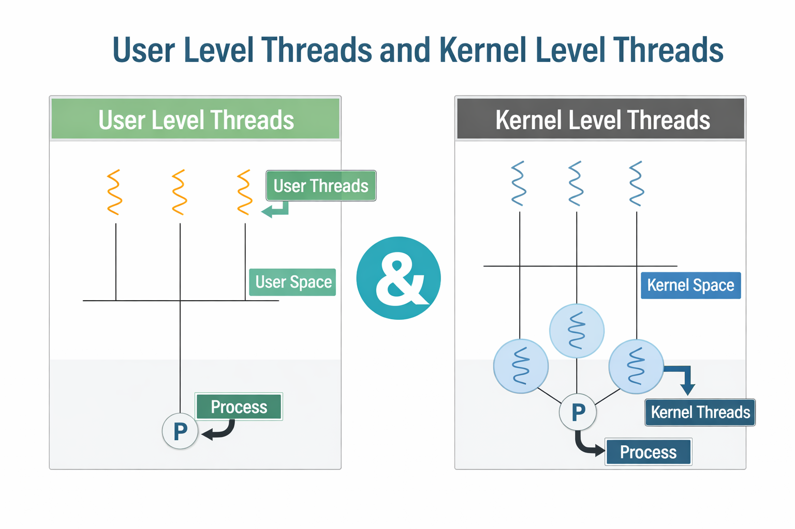
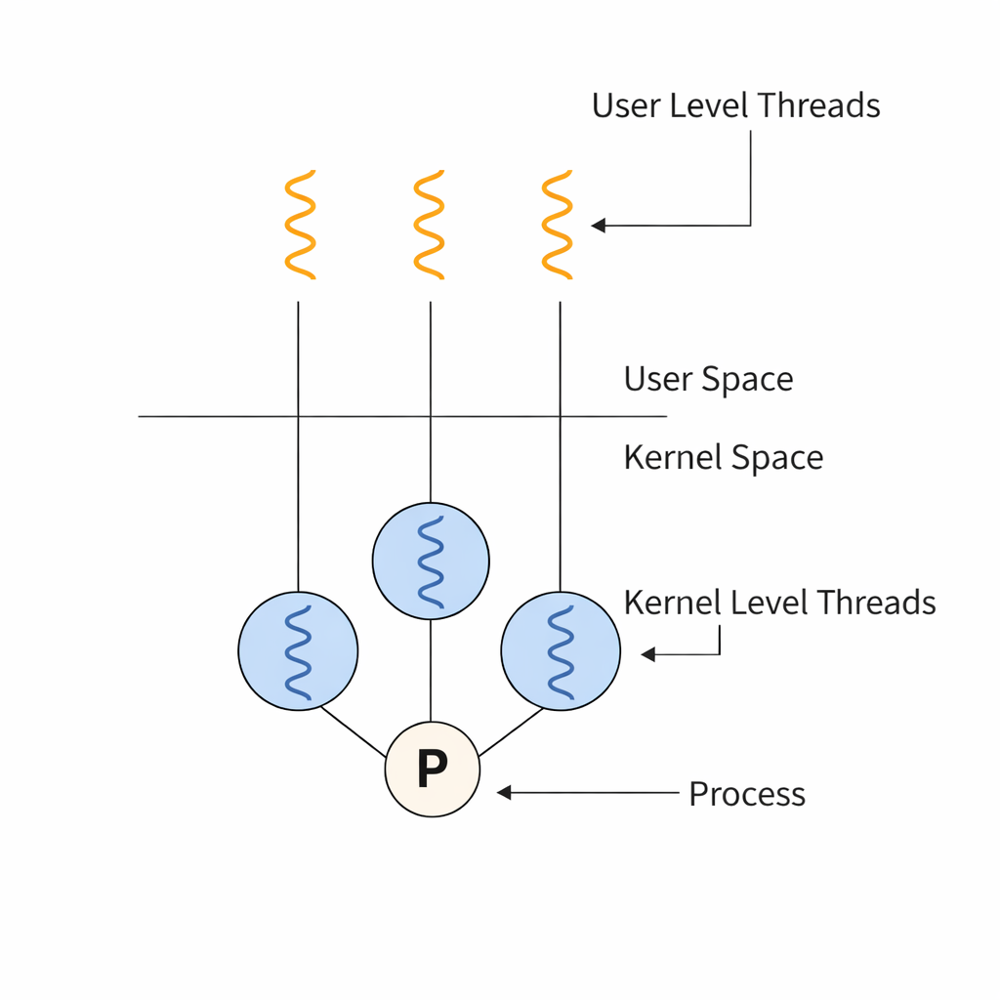

# User-Level vs Kernel-Level Threads

#### Two Fundamental Models of Thread Management in an Operating System

> Threads can be managed either in user space by a thread library or in kernel space by the OS directly. Each model has distinct trade-offs in performance, blocking behavior, and parallelism.

---

## 📌 Table of Contents

| # | Topic |
|---|-------|
| 1 | [Overview](#1-overview) |
| 2 | [✦ User-Level Threads](#2--user-level-threads) |
| 3 | [✦ Kernel-Level Threads](#3--kernel-level-threads) |
| 4 | [✦ Visual Comparison](#4--visual-comparison) |
| 5 | [✦ Multithreading Models](#5--multithreading-models) |
| 6 | [Comparison Table](#6-comparison-table) |
| 7 | [Interview Questions](#7-interview-questions) |
| 8 | [Resources](#8-resources) |

---

## 1. Overview

> Threads are managed either entirely in user space without kernel awareness, or directly by the kernel with full OS support.

- **User-Level Threads** -> managed by a user-space thread library, kernel sees the process as single-threaded
- **Kernel-Level Threads** -> managed by the OS kernel, each thread is a schedulable entity
- The relationship between user-level and kernel-level threads is defined by the **multithreading model**
- Choice of model affects performance, blocking behavior, and ability to run in true parallel

---

## 2. ✦ User-Level Threads

> User-level threads are created and managed entirely in user space without any kernel involvement.

- Thread library handles creation, scheduling, and synchronization -> no system calls needed
- Kernel is unaware of these threads -> it sees the entire process as one single thread
- Thread switching happens in user space -> extremely fast, no mode switch required
- Examples -> POSIX green threads, Java green threads, GNU Portable Threads

**Advantages:**
- Thread creation and context switching is very fast -> no kernel involvement
- Can be implemented on any OS -> even those that do not support threads natively
- Application can define its own custom scheduling algorithm

**Disadvantages:**
- If one thread makes a blocking system call -> the entire process blocks -> all other threads freeze
- Cannot achieve true parallelism -> kernel schedules only one process, not individual threads
- A thread performing a page fault blocks the entire process

```
User Space
┌──────────────────────────────────┐
│  Thread 1   Thread 2   Thread 3  │  <- managed by thread library
│     │           │          │     │
│     └───────────┴──────────┘     │
│           Thread Library         │
└─────────────────┬────────────────┘
                  │ one process visible to kernel
Kernel Space      ▼
             ┌─────────┐
             │ Process │
             └─────────┘
```

---

## 3. ✦ Kernel-Level Threads

> Kernel-level threads are managed directly by the OS — each thread is independently scheduled by the kernel.

- OS kernel maintains a separate structure for each thread
- Every thread creation, deletion, and synchronization requires a system call
- Kernel schedules threads independently -> one thread blocking does not affect others
- Examples -> Windows threads, Linux pthreads (NPTL), macOS GCD threads

**Advantages:**
- If one thread blocks on I/O -> other threads in the same process continue running
- Can run threads in true parallel on multiple CPU cores
- Kernel can optimize scheduling based on thread priorities and CPU affinity

**Disadvantages:**
- Thread creation and context switching is slower -> every operation requires a system call
- Higher overhead compared to user-level threads
- More kernel memory consumed -> one kernel structure per thread

```
User Space
┌──────────────────────────────────┐
│  Thread 1   Thread 2   Thread 3  │
└─────┬───────────┬───────────┬────┘
      │           │           │   system calls
Kernel Space      │           │
┌─────▼───────────▼───────────▼────┐
│  KThread 1  KThread 2  KThread 3 │  <- each scheduled independently
│        OS Kernel Scheduler        │
└───────────────────────────────────┘
```

---

## 4. ✦ Visual Comparison


> *Left: User-level threads exist only in user space — kernel sees one process P. Right: Kernel-level threads have corresponding kernel entities in kernel space, each scheduled by the OS independently.*


> *Orange threads are user-level threads in user space. Blue circles are kernel-level threads in kernel space. Process P connects both levels — kernel threads are the actual schedulable units on CPU.*

---

## 5. ✦ Multithreading Models

> The multithreading model defines how user-level threads are mapped to kernel-level threads.

**Many-to-One**
- Many user threads mapped to one kernel thread
- Thread management is fast -> done entirely in user space
- Only one thread can access kernel at a time -> no true parallelism
- One blocking call blocks all threads
- Example -> early Java green threads

```
User:    T1  T2  T3  T4
               ↓
Kernel:       K1
```

**One-to-One**
- Each user thread mapped to exactly one kernel thread
- True parallelism -> threads run on multiple cores simultaneously
- One thread blocking does not affect others
- Creating many threads is expensive -> kernel overhead per thread
- Example -> Windows, Linux pthreads

```
User:    T1    T2    T3
          ↓     ↓     ↓
Kernel:  K1    K2    K3
```

**Many-to-Many**
- Many user threads multiplexed over a smaller or equal number of kernel threads
- Provides parallelism without excessive kernel thread overhead
- One blocking thread does not block others
- Example -> Solaris, Windows with fiber support

```
User:    T1  T2  T3  T4  T5
            ↓    ↓    ↓
Kernel:    K1   K2   K3
```

**Two-Level Model**
- Variation of Many-to-Many
- Allows a user thread to be bound to a specific kernel thread when needed
- Most threads use Many-to-Many mapping -> critical threads use One-to-One binding
- Example -> IRIX, HP-UX, Tru64 UNIX

| Model | Parallelism | Blocking Impact | Overhead | Example |
|-------|-------------|----------------|----------|---------|
| Many-to-One | No | Entire process blocks | Low | Green threads |
| One-to-One | Yes | Only that thread blocks | High | Linux, Windows |
| Many-to-Many | Yes | Only that thread blocks | Moderate | Solaris |
| Two-Level | Yes | Configurable | Moderate | IRIX, HP-UX |

---

## 6. Comparison Table

| Feature | User-Level Threads | Kernel-Level Threads |
|---------|-------------------|---------------------|
| Managed by | User-space thread library | OS Kernel |
| Kernel awareness | Kernel unaware | Kernel manages each thread |
| Creation speed | Fast -> no system call | Slow -> system call required |
| Context switch | Fast -> user space only | Slow -> kernel involvement |
| Blocking on I/O | Entire process blocks | Only that thread blocks |
| True parallelism | No | Yes -> multiple cores |
| Portability | High -> runs on any OS | Low -> OS dependent |
| Overhead | Low | High |
| Example | POSIX green threads | Linux pthreads, Windows threads |

---

## 7. Interview Questions

**Q1. What is the difference between user-level and kernel-level threads?**
- User-level threads are managed by a thread library in user space -> kernel sees only one process
- Kernel-level threads are managed by the OS -> each thread is independently schedulable
- User-level threads are faster to create but block the entire process on I/O
- Kernel-level threads allow true parallelism and independent blocking

**Q2. Why do user-level threads block the entire process on I/O?**
- The kernel is unaware of individual user threads -> it treats the entire process as one entity
- When one thread makes a blocking system call, the kernel blocks the whole process
- All other user threads within that process are frozen as a result

**Q3. Which threading model does Linux use?**
- Linux uses the One-to-One model via NPTL (Native POSIX Thread Library)
- Each user thread has a corresponding kernel thread
- Allows true parallelism across multiple CPU cores

**Q4. What is the Many-to-Many threading model?**
- Multiple user threads are multiplexed over a smaller or equal number of kernel threads
- Provides parallelism without creating a kernel thread for every user thread
- One blocking thread does not block others since the kernel has multiple threads to schedule

**Q5. What is the Two-Level threading model?**
- A hybrid of Many-to-Many and One-to-One models
- Most threads use Many-to-Many mapping for efficiency
- Critical threads can be bound directly to a dedicated kernel thread for guaranteed scheduling

**Q6. Why are kernel-level threads slower to create than user-level threads?**
- Every kernel thread operation requires a system call -> involves a mode switch from user to kernel space
- Kernel must allocate its own data structure for each thread
- User-level thread creation is done entirely in user space -> no mode switch needed

**Q7. Can user-level threads achieve true parallelism on a multi-core CPU?**
- No -> the kernel sees the process as a single-threaded entity
- Only one core is used at a time regardless of how many user threads exist
- Kernel-level threads or a Many-to-Many model is required for true multi-core parallelism

---

## 8. Resources

- 📖 [GeeksforGeeks — User Level vs Kernel Level Threads](https://www.geeksforgeeks.org/difference-between-user-level-thread-and-kernel-level-thread/)
- 📖 [InterviewBit — OS Thread Questions](https://www.interviewbit.com/operating-system-interview-questions/)
- 📖 [PrepInsta — Threads in OS](https://prepinsta.com/operating-system/)
- 📖 [Baeldung — Multithreading Models](https://www.baeldung.com/cs/user-kernel-threads)

---

*Made for CS Students | Internship & Job Prep Series*