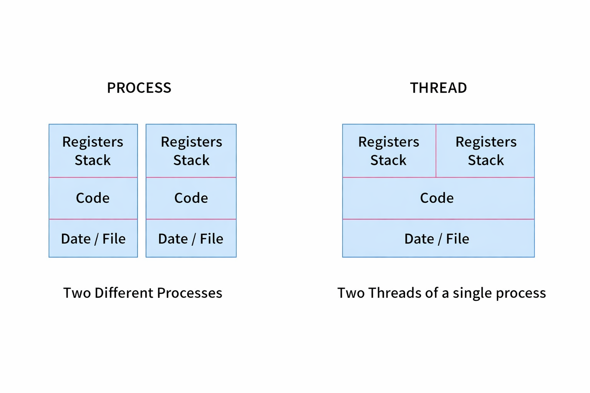

# Threads

#### The Lightweight Unit of Execution Within a Process

> A thread is the smallest unit of CPU execution. It exists within a process and shares the process's resources while maintaining its own execution context.

---

## 📌 Table of Contents

| # | Topic |
|---|-------|
| 1 | [What is a Thread](#1-what-is-a-thread) |
| 2 | [✦ Thread Components](#2--thread-components) |
| 3 | [✦ Process vs Thread](#3--process-vs-thread) |
| 4 | [✦ Single-threaded vs Multithreaded](#4--single-threaded-vs-multithreaded) |
| 5 | [✦ Benefits of Threads](#5--benefits-of-threads) |
| 6 | [Thread States](#6-thread-states) |
| 7 | [Types of Threads](#7-types-of-threads) |
| 8 | [Interview Questions](#8-interview-questions) |
| 9 | [Resources](#9-resources) |

---

## 1. What is a Thread

> A thread is an independent path of execution within a process, sharing the process's memory and resources.

- Also called a **lightweight process**
- A process can contain one or more threads running concurrently
- All threads of a process share the same code, data, and files
- Each thread has its own stack, registers, and program counter
- Thread creation is faster and cheaper than process creation
- Communication between threads is faster than between processes -> they share the same address space

---

## 2. ✦ Thread Components

> Each thread carries its own private execution context while sharing process-level resources.

**What each thread owns privately:**
- Program Counter -> tracks the next instruction for that thread
- CPU Registers -> holds current register values for that thread
- Stack -> stores local variables and function call frames for that thread
- Thread ID -> unique identifier within the process

**What all threads share within a process:**
- Code segment -> same program instructions
- Data segment -> global and static variables
- Heap -> dynamically allocated memory
- Open files -> same file descriptors
- Signals -> signal handlers defined by the process

```
┌──────────────────────────────────────────┐
│               Process                    │
│                                          │
│   Shared: Code | Data | Files | Heap     │
│  ┌────────────┐  ┌────────────┐          │
│  │  Thread 1  │  │  Thread 2  │          │
│  │ ---------- │  │ ---------- │          │
│  │ Registers  │  │ Registers  │          │
│  │ Stack      │  │ Stack      │          │
│  │ Counter    │  │ Counter    │          │
│  └────────────┘  └────────────┘          │
└──────────────────────────────────────────┘
```

---

## 3. ✦ Process vs Thread

> Two processes are fully isolated. Two threads within the same process share most resources.


> *Two different processes each have their own Registers, Stack, Code, and Data. Two threads of a single process share Code and Data but have separate Registers and Stack.*

| Feature | Process | Thread |
|---------|---------|--------|
| Definition | Program in execution | Unit of execution within a process |
| Memory | Separate address space | Shared address space |
| Creation cost | High -> new memory space allocated | Low -> shares existing memory |
| Communication | Via IPC -> pipes, sockets, shared memory | Direct -> shared memory within process |
| Context switch cost | High -> TLB flush, page table reload | Low -> no address space change |
| Crash impact | One process crash does not affect others | One thread crash can bring down entire process |
| Resources | Each process has own resources | Threads share process resources |
| Overhead | More overhead | Less overhead |

---

## 4. ✦ Single-threaded vs Multithreaded

> A single-threaded process has one execution path. A multithreaded process has multiple concurrent paths sharing the same resources.


> *Single-threaded process: one thread with its own Registers, Counter, and Stack sharing Code, Data, and Files. Multithreaded process: three threads each with private Registers, Stack, and Counter all sharing the same Code, Data, and Files.*

**Single-threaded Process:**
- Only one thread of execution exists
- Tasks are performed sequentially one after another
- If the thread blocks on I/O, the entire process waits
- Simpler to design and debug
- Example -> basic command-line tools like `cat`, `ls`

**Multithreaded Process:**
- Multiple threads execute concurrently within the same process
- One thread can perform I/O while another continues computation
- Better CPU utilization on multi-core systems
- More complex -> requires synchronization to avoid race conditions
- Example -> web browser with separate threads for rendering, networking, and UI

---

## 5. ✦ Benefits of Threads

> Threads improve performance, responsiveness, and resource efficiency compared to multiple processes.

**Responsiveness**
- Application remains responsive even when part of it is blocked
- Example -> a browser keeps rendering the page while another thread downloads images

**Resource Sharing**
- Threads share code, data, and files automatically
- No need for explicit IPC mechanisms like pipes or sockets
- Reduces memory usage compared to spawning multiple processes

**Economy**
- Thread creation takes far less time than process creation
- Context switching between threads is cheaper than between processes
- Solaris measured thread creation as 30x faster than process creation

**Scalability**
- Threads can run truly in parallel on multiple CPU cores
- A single-threaded process can only use one core at a time regardless of available cores
- Multithreaded programs scale with the number of CPU cores

---

## 6. Thread States

> Threads follow the same state model as processes but are managed at a finer granularity.

| State | Description |
|-------|-------------|
| **New** | Thread is created but not yet started |
| **Runnable** | Thread is ready to run or currently running |
| **Blocked** | Thread is waiting for I/O or a lock |
| **Waiting** | Thread is waiting indefinitely for another thread to signal it |
| **Timed Waiting** | Thread is waiting for a specific duration |
| **Terminated** | Thread has completed execution |

- In Java these states are explicitly defined in the `Thread.State` enum
- In C/POSIX threads the states map to similar OS-level scheduling states

---

## 7. Types of Threads

> Threads are classified based on where they are managed -> in user space or kernel space.

**User-Level Threads**
- Managed entirely by a user-space thread library -> kernel is unaware of them
- Thread creation, switching, and synchronization done without system calls
- Fast to create and switch -> no kernel involvement
- If one thread blocks on I/O -> entire process blocks since kernel sees only one thread

**Kernel-Level Threads**
- Managed directly by the OS kernel
- Kernel schedules each thread independently
- If one thread blocks -> others in the same process continue running
- Slower to create and switch -> every operation requires a system call

| Feature | User-Level Threads | Kernel-Level Threads |
|---------|-------------------|---------------------|
| Management | User-space library | OS Kernel |
| Speed | Fast | Slower |
| I/O blocking | Blocks entire process | Only blocks that thread |
| Parallelism | Cannot run in true parallel | Can run on multiple cores |
| Example | POSIX green threads | Windows threads, Linux pthreads |

---

## 8. Interview Questions

**Q1. What is a thread?**
- Smallest unit of CPU execution within a process
- Shares code, data, heap, and files with other threads in the same process
- Has its own program counter, registers, and stack

**Q2. What is the difference between a process and a thread?**
- Process has its own separate address space -> thread shares the address space of its parent process
- Process creation is expensive -> thread creation is lightweight
- Context switch between processes requires TLB flush -> thread switch does not
- A crashed process does not affect others -> a crashed thread can crash the entire process

**Q3. What do threads share and what do they not share?**
- Shared -> code segment, data segment, heap, open files, signal handlers
- Not shared -> stack, registers, program counter, thread ID

**Q4. Why are threads called lightweight processes?**
- Thread creation requires no new address space allocation
- Thread context switch is cheaper since no TLB flush is needed
- Threads share resources of the parent process -> no duplication of code, data, or files

**Q5. What happens when one thread in a process crashes?**
- Since all threads share the same address space, a crash in one thread can corrupt shared memory
- The OS typically terminates the entire process when an unhandled exception occurs in any thread

**Q6. Can two threads of the same process run on different CPU cores simultaneously?**
- Yes -> kernel-level threads can be scheduled on different cores by the OS
- This is true parallelism -> both threads execute instructions at the exact same instant
- User-level threads cannot achieve this since the kernel sees them as a single entity

**Q7. What is the difference between user-level and kernel-level threads?**
- User-level threads are managed by a library without kernel knowledge -> fast but block entire process on I/O
- Kernel-level threads are managed by the OS -> slower to create but allow true parallelism and independent blocking

---

## 9. Resources

- 📖 [GeeksforGeeks — Threads in OS](https://www.geeksforgeeks.org/thread-in-operating-system/)
- 📖 [InterviewBit — OS Thread Questions](https://www.interviewbit.com/operating-system-interview-questions/)
- 📖 [PrepInsta — Threads in OS](https://prepinsta.com/operating-system/)
- 📖 [Baeldung — Threads vs Processes](https://www.baeldung.com/cs/process-vs-thread)

---

*Made for CS Students | Internship & Job Prep Series*